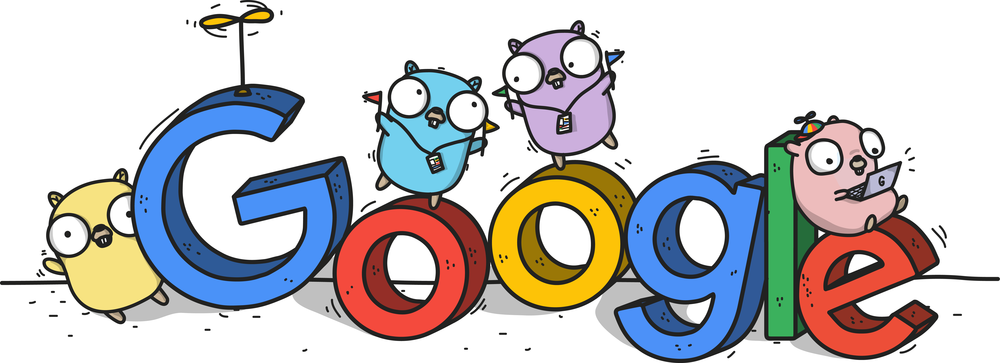

# course-golang

Go language studies from the YouTube website.

All files were based on the course from the cited website.

https://www.youtube.com/c/AprendaGo/about

https://github.com/ellenkorbes/aprendago

https://github.com/ashleymcnamara/gophers

## Others

See also the repositories [beecrowd-programming](https://github.com/thiagoneye/beecrowd-programming) and [book-golang](https://github.com/thiagoneye/book-golang).
